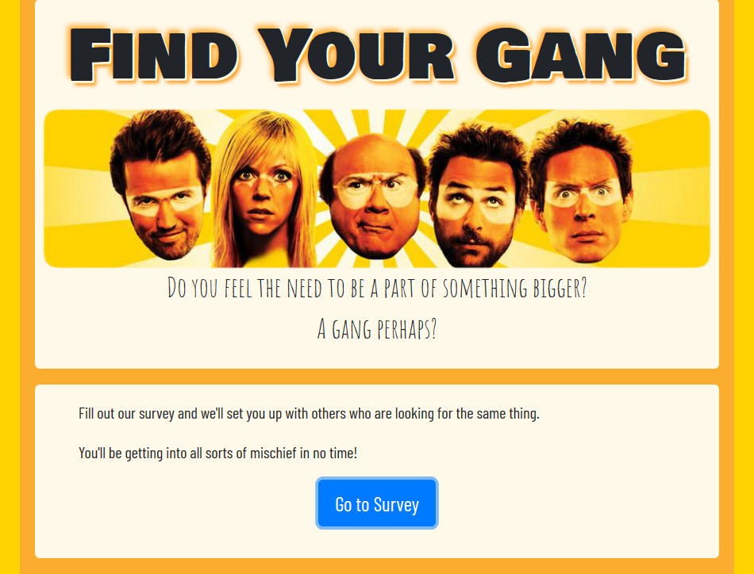
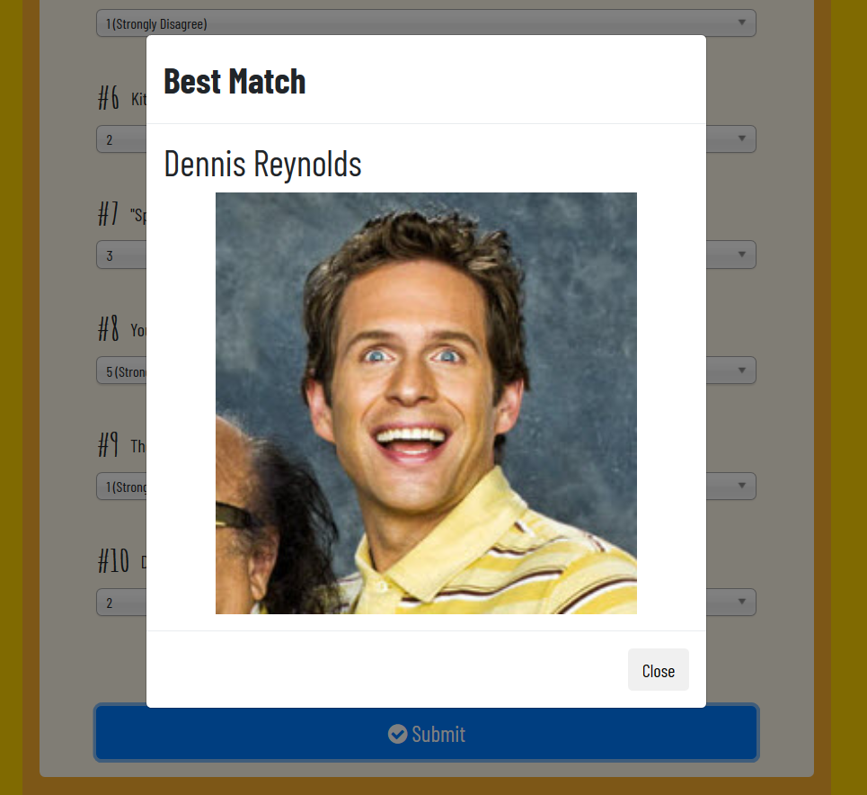

# Find Your Gang

## Overview

Become a gang member!

Fill out our survey and get matched up with other users who share similar interests.

This responsive, full stack web application uses Bootstrap, Node, Express, and a JSON database to setup the server, handle requests, and collect user-submitted data.

Try it out now @ https://find-your-gang.herokuapp.com/

Home Screen   

After the survey is completed, the name and photo of the user whose answers best match with yours is displayed.   

## Future Development

* Creation of multiple surveys.
* Add option to message users directly for immediate connection.

## Authors

* **Justin Flick** - *Everything*